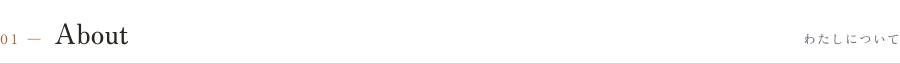
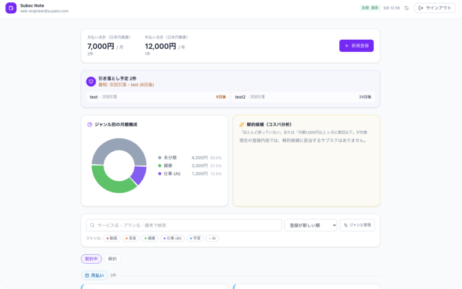
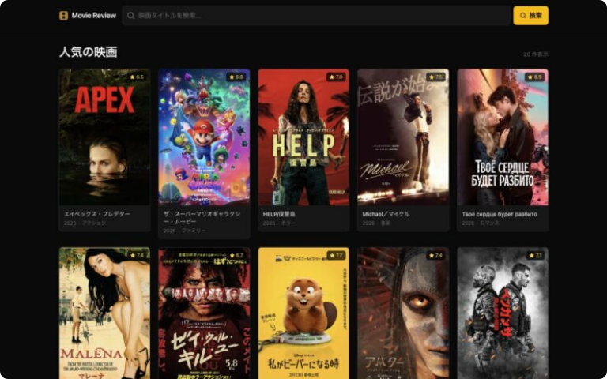
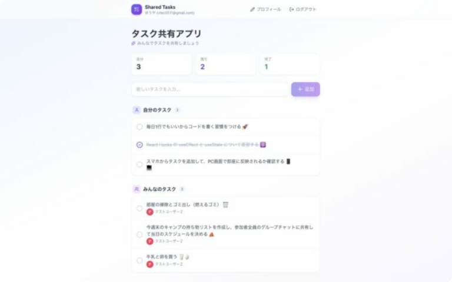
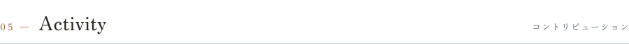
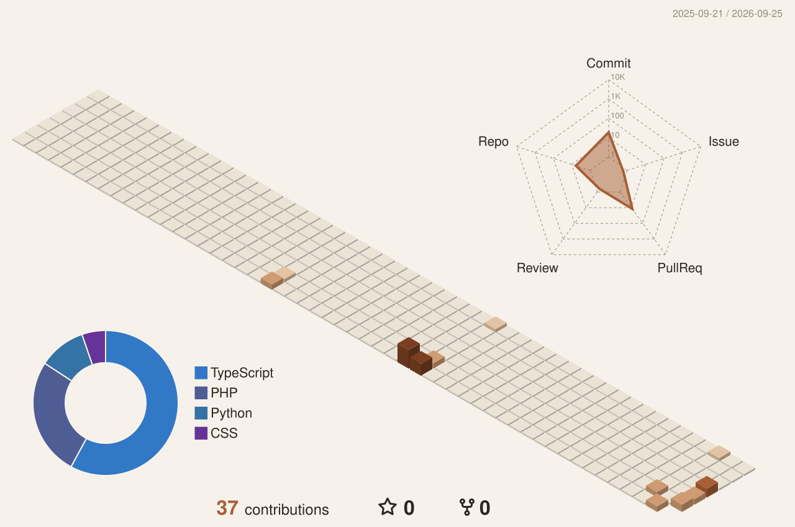
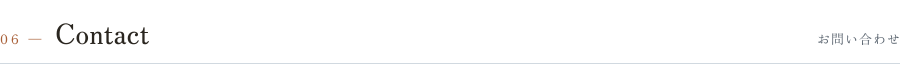

<picture>
  <source media="(prefers-color-scheme: dark)" srcset="./assets/banner-dark.svg">
  
</picture>

 

<picture>
  <source media="(prefers-color-scheme: dark)" srcset="./assets/sections/about-dark.svg">
  
</picture>

新潟をベースに活動する Webコーダー／フロントエンドエンジニアです。 デザインという静的な設計図に、コードで命を吹き込む瞬間にいちばんやりがいを感じます。

- 🏠 WordPress オリジナルテーマ制作・既存サイトの改修
- ⚛️ React / TypeScript での個人開発（Vercel デプロイ）
- 🤝 お仕事のご相談・副業案件 受付中

 

<picture>
  <source media="(prefers-color-scheme: dark)" srcset="./assets/sections/skills-dark.svg">
  
</picture>

  <picture>
    <source media="(prefers-color-scheme: dark)" srcset="https://skillicons.dev/icons?i=html%2Ccss%2Cjs%2Cts%2Creact%2Cjquery%2Cwordpress%2Cphp%2Cfigma%2Cxd%2Cai%2Cgithub&theme=dark&perline=12">
    
  </picture>

 

<picture>
  <source media="(prefers-color-scheme: dark)" srcset="./assets/sections/works-dark.svg">
  
</picture>

<!-- WORKS:START -->
<table>
<tr>
<td width="33%" valign="top">
 
<a href="https://yuyaoo.com/subsc-note%ef%bc%88%e3%82%b5%e3%83%96%e3%82%b9%e3%82%af%e7%ae%a1%e7%90%86%e3%82%a2%e3%83%97%e3%83%aa%ef%bc%89/"><b>Subsc Note（サブスク管理アプリ）</b></a> 
  
</td>
<td width="33%" valign="top">
 
<a href="https://yuyaoo.com/%e3%83%88%e3%83%ac%e3%83%b3%e3%83%89%e3%82%b7%e3%83%8d%e3%83%9e/"><b>トレンドシネマ</b></a> 
 
</td>
<td width="33%" valign="top">
 
<a href="https://yuyaoo.com/shared-tasks/"><b>タスク共有アプリ</b></a> 
  
</td>
</tr>
</table>
<!-- WORKS:END -->

<a href="https://yuyaoo.com/"><b>VIEW ALL WORKS →</b></a>

<picture>
  <source media="(prefers-color-scheme: dark)" srcset="./assets/sections/blog-dark.svg">
  
</picture>

<!-- BLOG:START -->
- `2026.08.26` [【解決】kintone MCPサーバーが急に接続エラー｜原因はJSON Schemaだった](https://codecabinbyyuya.com/2026/08/26/kintone-mcp-server-connection-error/)
- `2026.07.10` [【初心者向け】WordPressで問い合わせフォームを作る方法！Contact Form 7の使い方と集客のコツ](https://codecabinbyyuya.com/2026/07/10/wordpress-contact-form-7/)
- `2026.06.27` [【初心者向け】Reactに入る前に知っておきたいJavaScriptの基礎9選](https://codecabinbyyuya.com/2026/06/27/javascript-basics-before-react/)
<!-- BLOG:END -->

<a href="https://codecabinbyyuya.com/"><b>READ ON BLOG →</b></a>

<picture>
  <source media="(prefers-color-scheme: dark)" srcset="./assets/sections/activity-dark.svg">
  
</picture>

<picture>
  <source media="(prefers-color-scheme: dark)" srcset="./profile-3d-contrib/profile-3d-dark.svg">
  
</picture>

 

<picture>
  <source media="(prefers-color-scheme: dark)" srcset="./assets/sections/contact-dark.svg">
  
</picture>

  
  
  
  

  

